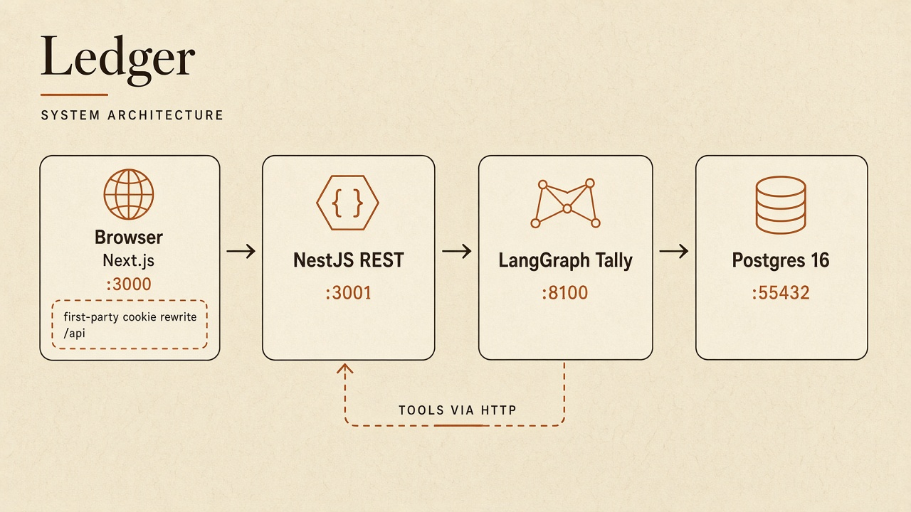
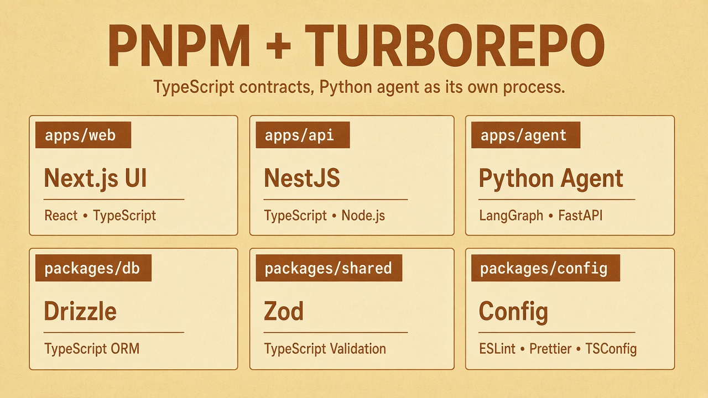
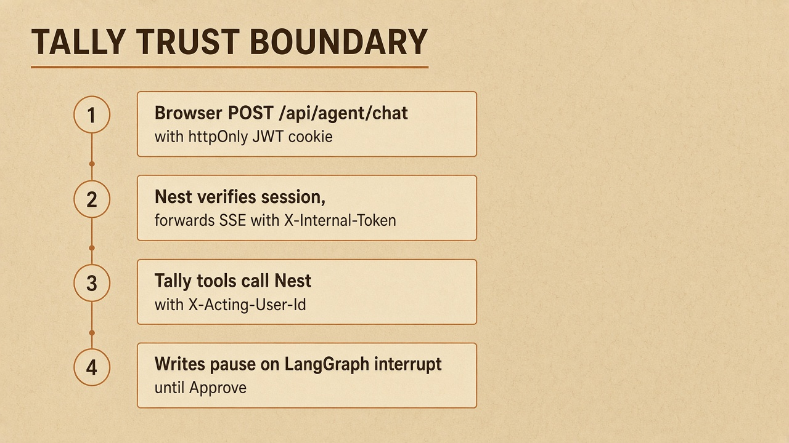
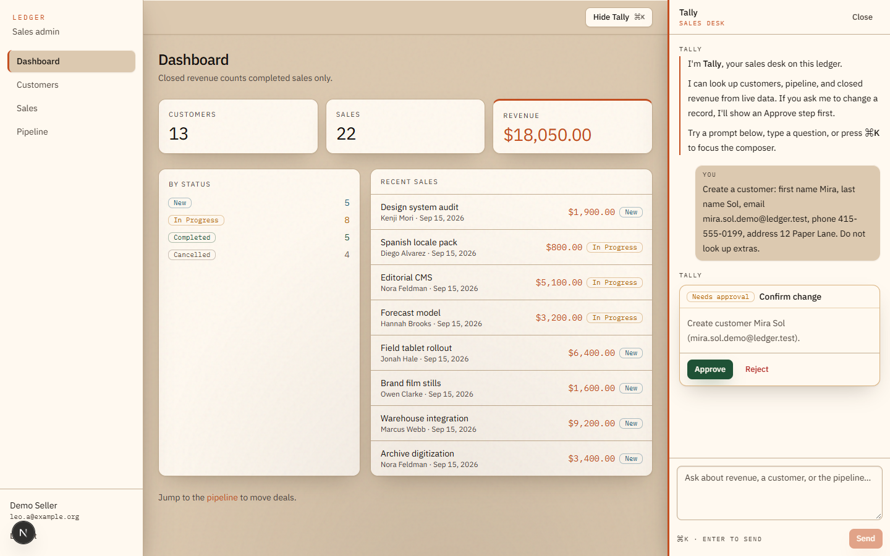
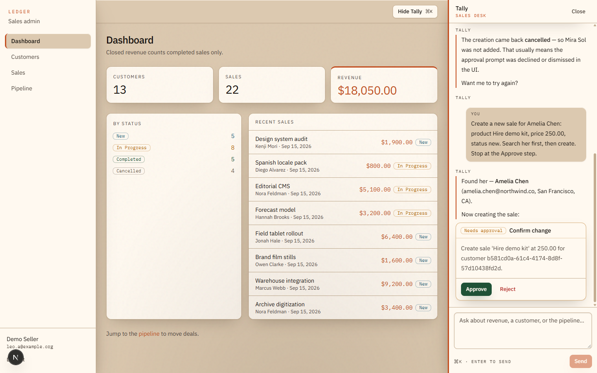
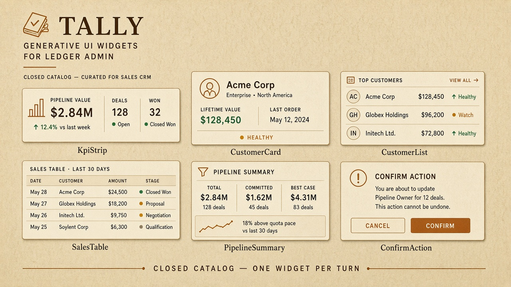
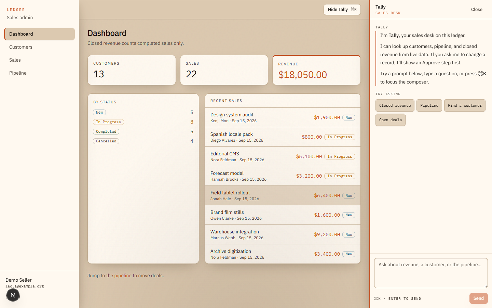
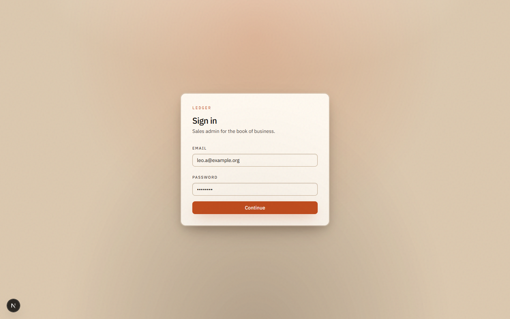
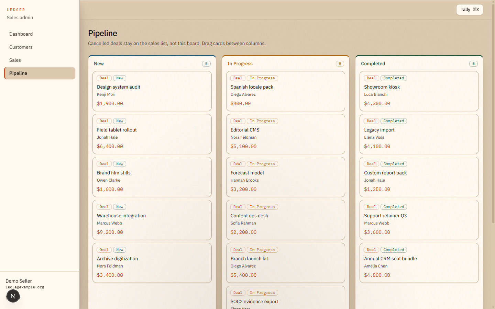
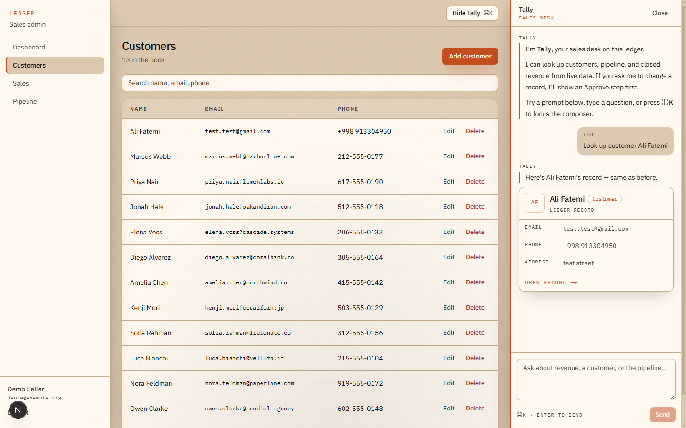

# Ledger

Internal **sales admin** (customers, deals, pipeline) plus **Tally** — a LangGraph sales desk that answers from live CRM data and renders **generative UI**, not markdown dumps.

Take-home built as a real product: typed contracts, Nest-owned invariants, first-party auth, HITL writes.

## Architecture



Browser talks only to Next (`:3000`). `/api/*` **rewrites** to Nest (`:3001`) so the session cookie is first-party. Tally (`:8100`) is never called from the browser.



| Path | Role |
| --- | --- |
| `apps/web` | UI |
| `apps/api` | REST + agent proxy |
| `apps/agent` | LangGraph |
| `packages/db` | schema, migrations, seed |
| `packages/shared` | Zod shared by web + api |



1. `POST /api/agent/chat` with cookie  
2. Nest verifies JWT, proxies **SSE** with `AGENT_INTERNAL_TOKEN`  
3. Tools call Nest HTTP (`X-Acting-User-Id`) — **no CRM SQL in the graph**  
4. Writes `interrupt()` until Approve  

Writes pause on a **ConfirmAction** card until you Approve or Reject. Nothing hits Nest until then.







Closed catalog, **one data widget per turn**: `KpiStrip` · `CustomerCard` · `CustomerList` · `SalesTable` · `PipelineSummary` · `ConfirmAction`

Full notes: [specs/architecture.md](./specs/architecture.md) · [specs/decisions.md](./specs/decisions.md)

## Keywords

`TypeScript` · `React` · `Next.js 15` · `NestJS` · `Zod` · `Drizzle ORM` · `PostgreSQL` · `TanStack Query` · `Tailwind CSS` · `pnpm` · `Turborepo` · `Python` · `FastAPI` · `LangGraph` · `LangChain` · `generative UI` · `SSE` · `httpOnly JWT` · `human-in-the-loop` · `Kanban` · `dnd-kit`

## Tech stack

| Layer | |
| --- | --- |
| Web | Next.js App Router, React 19, TanStack Query, Tailwind, shadcn primitives restyled |
| API | NestJS, Zod DTOs, JWT in httpOnly cookie |
| Data | Postgres 16, Drizzle (`numeric` prices as strings) |
| Agent | FastAPI + LangGraph, DeepSeek via OpenCode Go |
| Repo | pnpm workspaces, Turborepo |

## Product









- Dashboard KPIs; **revenue = completed only**  
- Customers / sales CRUD  
- Pipeline: drag on desktop, stage + Move-to on mobile; **cancelled off the board**  
- Tally: tools, Postgres checkpointer, long-term `agent_memories`

## Decisions I would defend in interview

- Cookie JWT + rewrite, not tokens in `localStorage`  
- Invariants in Nest services; graph routes and renders  
- HITL for mutations (`interrupt`)  
- Closed genUI library (not free-form model HTML)  

## Run

Node 20+, pnpm 9, Docker. Postgres on **localhost:55432**.

```bash
cp .env.example .env
docker compose up -d
pnpm install
pnpm db:migrate
pnpm db:seed
pnpm dev
```

[http://localhost:3000](http://localhost:3000) — `leo.a@example.org` / `demo1234`

Tally needs `OPENCODE_GO_API_KEY`. CRUD works without it.

| | |
| --- | --- |
| `pnpm test` | API + agent |
| `pnpm lint` | typecheck |

## Built with

Cursor for scaffolding and iteration. I owned auth boundary, revenue definition, Kanban rules, tool HTTP, genUI discipline, and the Ledger visual system.
