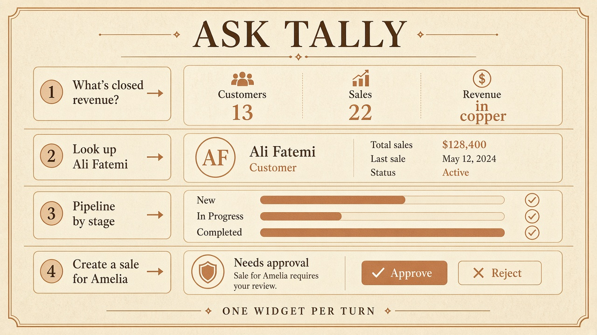
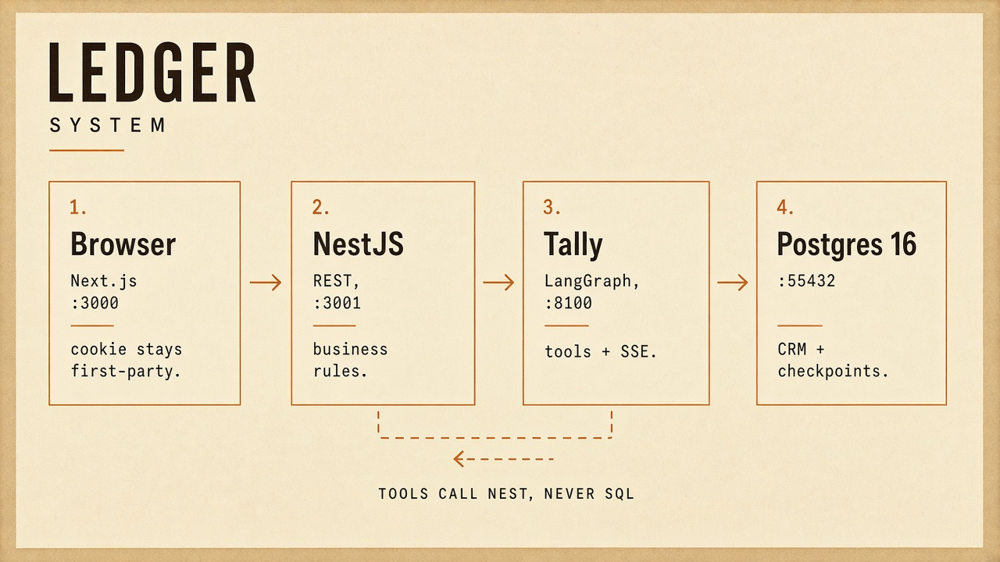
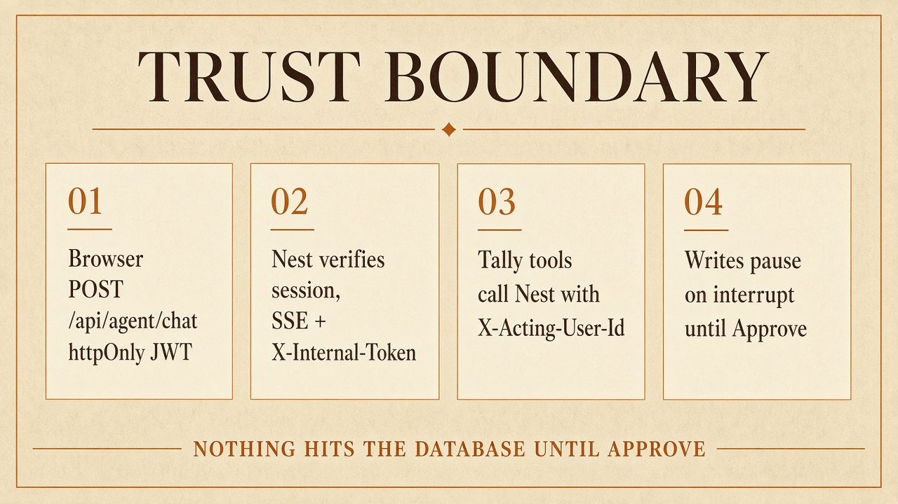
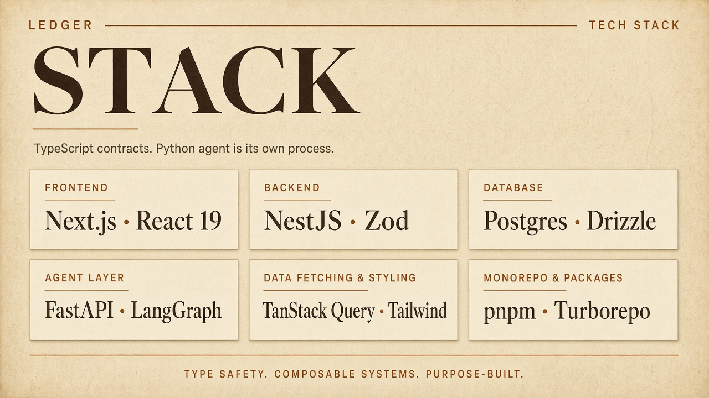

# Ledger

[](https://nextjs.org)
[](https://react.dev)
[](https://nestjs.com)
[](https://www.postgresql.org)
[](https://orm.drizzle.team)
[](https://langchain-ai.github.io/langgraph/)
[](https://www.python.org)
[](https://pnpm.io)
[](./LICENSE)

Sales admin for one book of business, plus **Tally** — a LangGraph desk that reads live CRM data and answers with **one UI widget**, not a markdown dump.

Writes do not touch Nest until you press **Approve**.


## Ask Tally



| You say | Tally calls | You see |
| --- | --- | --- |
| What's our closed revenue? | `get_dashboard_stats` | KPI strip. Revenue is **completed sales only**. |
| Look up Ali Fatemi | `search_customers` | One `CustomerCard`, or a `CustomerList` if several match. |
| Pipeline by stage | `get_pipeline` | `PipelineSummary` — New, In Progress, Completed. |
| Which deals are in progress? | `search_sales` | `SalesTable`. |
| Create a sale for Amelia Chen, Hire demo kit, $250 | `search_customers`, then `create_sale` | **Needs approval.** Reject writes nothing. |

Spoken reply stays one sentence. The widget holds the record.


## Architecture



The browser only talks to Next on `:3000`. `/api/*` rewrites to Nest on `:3001`, so the JWT cookie is first-party. Tally (`:8100`) is never a public origin. Its tools call Nest HTTP. The graph does not open CRM SQL. Checkpoints live in Postgres schema `langgraph`.



| Path | Owns |
| --- | --- |
| `apps/web` | Next.js UI, TanStack Query |
| `apps/api` | Nest REST, Zod, auth, agent proxy |
| `apps/agent` | FastAPI + LangGraph |
| `packages/db` | Drizzle schema, migrations, seed |
| `packages/shared` | Zod contracts for web and API |

Deeper notes: [specs/architecture.md](./specs/architecture.md) · [specs/decisions.md](./specs/decisions.md) · [specs/agent.md](./specs/agent.md)

## Stack



| | |
| --- | --- |
| UI | Next.js 15, React 19, Tailwind, restyled shadcn primitives, dnd-kit Kanban |
| API | NestJS, Zod DTOs, httpOnly JWT |
| Data | Postgres 16, Drizzle, `numeric` prices as strings |
| Agent | FastAPI, LangGraph, DeepSeek via OpenCode Go, SSE |
| Repo | pnpm workspaces, Turborepo |

## Product


- Customers and sales: search, create, edit, delete
- Pipeline: drag on desktop; one stage + Move-to on a phone. Cancelled stays off the board
- Tally: tools, Postgres checkpointer, long-term `agent_memories`, closed genUI catalog

`KpiStrip` · `CustomerCard` · `CustomerList` · `SalesTable` · `PipelineSummary` · `ConfirmAction`

## What I would defend

- Cookie + same-origin rewrite, not a token in `localStorage`
- CRM rules in Nest services. The graph routes and renders
- `interrupt()` before every write
- Closed widgets. The model does not emit HTML
- Frozen evals. CI does not call the model

## Run

Node 20+, pnpm 9, Docker. Postgres on **localhost:55432**.

```bash
cp .env.example .env
docker compose up -d
pnpm install
pnpm db:migrate
pnpm db:seed
pnpm dev
```

[http://localhost:3000](http://localhost:3000) — `leo.a@example.org` / `demo1234`

Tally needs `OPENCODE_GO_API_KEY`. The CRM works without it. Optional traces: `LANGSMITH_API_KEY`, project `ledger-tally`.

| | |
| --- | --- |
| `pnpm test` | API e2e (needs the database) + agent evals |
| `pnpm lint` | typecheck |

## Evals

`apps/agent/evals/cases.json` — frozen turns. Pytest checks the widget, not the model. Policy tests: interrupt before POST, reject skips the mutation, HTTP 500 stays an error dict, invented ids never hit Nest.

## Built with

Cursor for scaffolding. I set the auth boundary, the revenue rule, Kanban scope, tool HTTP, one-widget genUI, HITL, and the eval suite.
